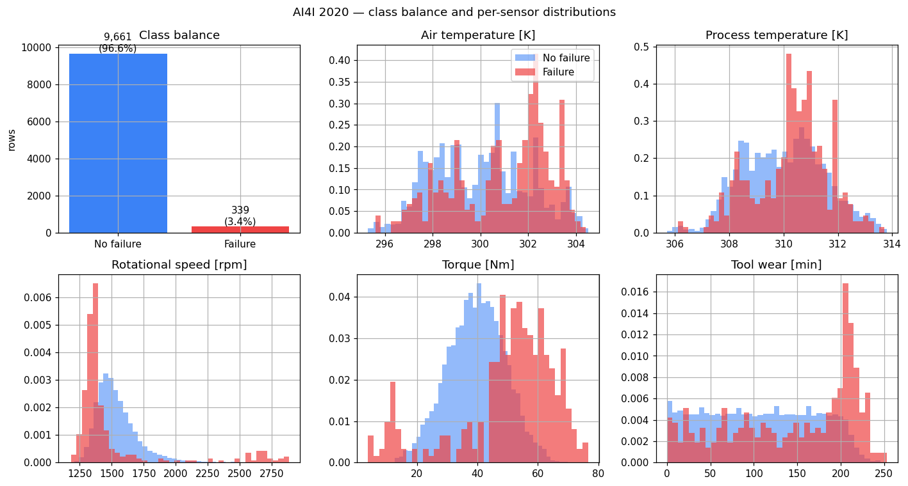
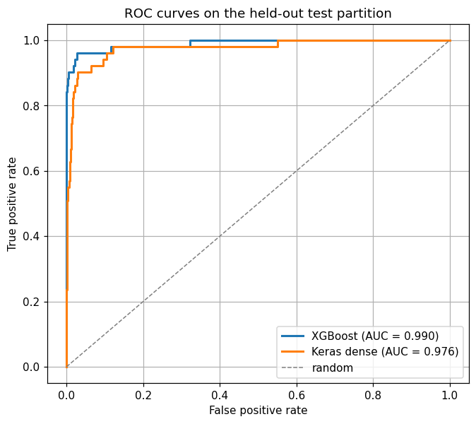
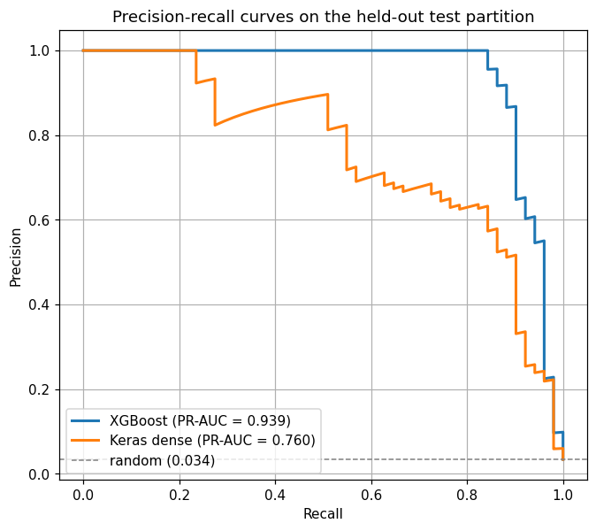
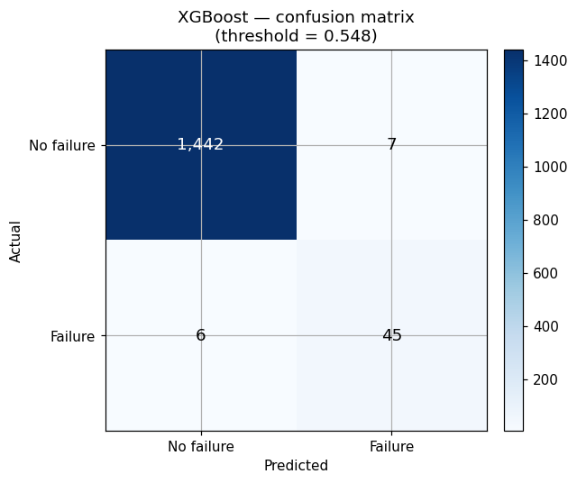
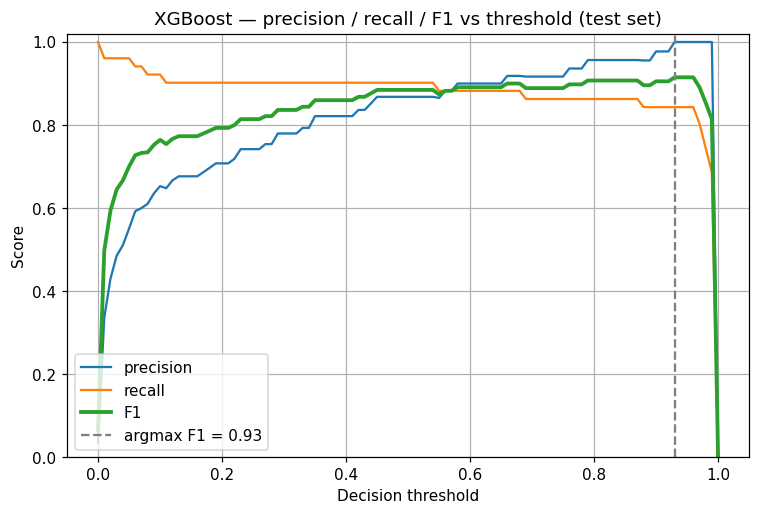
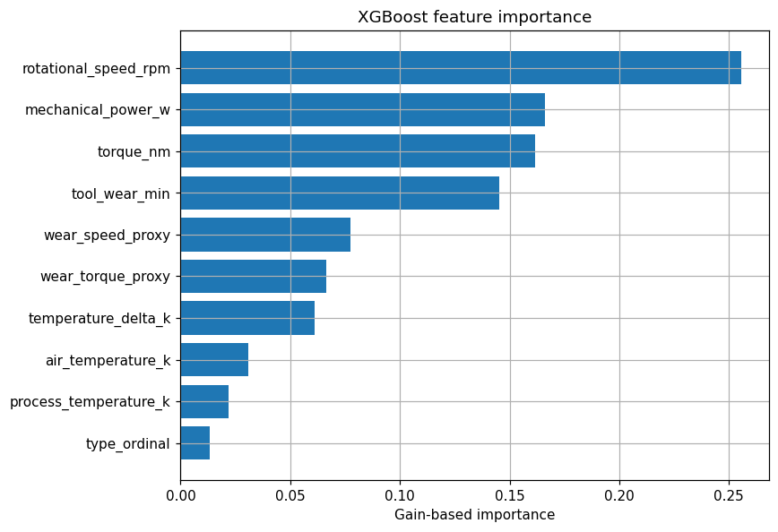

# Sentinel Stream

[](https://github.com/TomasUrban0/sentinel-stream/actions/workflows/ci.yml)
[](https://www.python.org/downloads/)
[](https://github.com/astral-sh/ruff)
[](#license)

**Real-time predictive maintenance for industrial machinery, evaluated on the [AI4I 2020 Predictive Maintenance Dataset](https://www.kaggle.com/datasets/stephanmatzka/predictive-maintenance-dataset-ai4i-2020).**

Sentinel Stream is an end-to-end machine-learning system that ingests sensor telemetry from a manufacturing line, engineers physically-meaningful features at scale with PySpark, trains a gradient-boosted classifier (with a Keras dense neural network as a comparison model), and serves failure-probability predictions in real time through a FastAPI service. It includes drift monitoring, containerised deployment, and a CI pipeline.

The project is built to demonstrate how data-engineering practice translates into a production ML system: feature engineering with Spark, reproducible training, schema-validated serving, latency monitoring, drift detection, Docker, and CI.

---

## Why this project

A predictive-maintenance system has to do five things end-to-end:

- ingest sensor data continuously, not from a CSV;
- engineer features deterministically across training and inference (no train/serve skew);
- serve predictions with low, predictable latency under realistic load;
- detect when the live data has drifted away from the training distribution;
- be reproducible, tested, containerised, and integrated with CI.

Sentinel Stream addresses each of these in a single codebase, on a published industrial benchmark.

---

## Dataset

[**AI4I 2020 Predictive Maintenance Dataset**](https://www.kaggle.com/datasets/stephanmatzka/predictive-maintenance-dataset-ai4i-2020) — 10 000 production runs of a synthetic milling machine. Each row is one run of one workpiece, with six sensor readings and a binary `Machine failure` target. Approximately 3.4 % of runs end in failure (mild class imbalance is part of the problem).

| Field | Meaning |
|---|---|
| `Type` | Product variant: L (60 %), M (30 %), H (10 %) |
| `Air temperature [K]` | Ambient temperature |
| `Process temperature [K]` | Tool-tip temperature |
| `Rotational speed [rpm]` | Spindle speed |
| `Torque [Nm]` | Cutting torque |
| `Tool wear [min]` | Cumulative tool wear |
| `Machine failure` | Target — did this run end in failure? |



---

## Architecture

```
+----------------+      +------------------+      +-----------------+
|  AI4I CSV      | ---> |  Feature         | ---> |  Model trainer  |
|  (6 sensors    |      |  engineering     |      |  (XGBoost +     |
|   + target)    |      |  (PySpark)       |      |   Keras dense)  |
+----------------+      +------------------+      +-----------------+
                                                          |
                                                          v
+----------------+      +------------------+      +-----------------+
|  Stream        | ---> |  FastAPI         | ---> |  Failure prob.  |
|  simulator     |      |  inference API   |      |  + alert        |
+----------------+      +------------------+      +-----------------+
                               |
                               v
                       +------------------+
                       |  Drift monitor   |
                       |  (KS test on     |
                       |   feature dist.) |
                       +------------------+
```

---

## Tech stack

| Layer            | Tools                                      |
|------------------|--------------------------------------------|
| Data processing  | PySpark, Pandas, NumPy                     |
| Modeling         | XGBoost, TensorFlow / Keras, Scikit-learn  |
| Serving          | FastAPI, Uvicorn, Pydantic                 |
| Monitoring       | SciPy (KS test), custom metrics endpoint   |
| Infrastructure   | Docker, docker-compose                     |
| CI               | GitHub Actions, Ruff, Pytest               |

---

## Feature engineering

PySpark builds five derived features on top of the six raw sensor readings, all grounded in the physics of the milling process:

- `temperature_delta_k` — `process_temperature − air_temperature`. Heat dissipation failures show up as compressed deltas.
- `mechanical_power_w` — `torque × rotational_speed × 2π / 60`. Power-failure mode (PWF) lives directly in this dimension.
- `wear_torque_proxy` — `torque × tool_wear`. Tracks overstrain risk (OSF mode).
- `wear_speed_proxy` — `rotational_speed × tool_wear`. Tracks tool-fatigue risk (TWF mode).
- `type_ordinal` — categorical product variant encoded as 1 / 2 / 3.

The exact same transformations are reproduced row-by-row in [`StreamingFeatureTransformer`](src/sentinel_stream/features/transformer.py) so training-time and serving-time features are byte-for-byte identical.

---

## Project structure

```
sentinel-stream/
├── src/sentinel_stream/
│   ├── data/          # AI4I loader (column normalisation, CSV resolution)
│   ├── features/      # PySpark feature engineering + streaming transformer
│   ├── models/        # XGBoost classifier, Keras dense classifier, eval helpers
│   ├── serving/       # FastAPI app, Pydantic schemas
│   ├── monitoring/    # Drift detection (Kolmogorov-Smirnov)
│   └── utils/         # Logging, config loading
├── scripts/
│   ├── download_data.py    # fetch AI4I from Kaggle
│   ├── train.py            # train + tune both classifiers
│   ├── generate_plots.py   # render evaluation plots into docs/img/
│   └── simulate_stream.py  # replay rows against the API
├── notebooks/
│   └── exploration.ipynb   # EDA + modelling walkthrough
├── tests/             # unit + integration + end-to-end tests
├── config/config.yaml
├── docs/img/          # PNGs embedded in this README
├── Makefile
├── Dockerfile
├── docker-compose.yml
└── .github/workflows/ci.yml
```

---

## Quick start

You will need a [Kaggle API token](https://www.kaggle.com/settings) at `~/.kaggle/kaggle.json` for the data download step.

```bash
make setup     # install dependencies in editable mode
make data      # download AI4I 2020 into data/ai4i/
make train     # train both classifiers, write artifacts/ and metrics.json
make plots     # render evaluation PNGs into docs/img/
make serve     # start the FastAPI service on :8000
make simulate  # replay a shuffled stream against the running API
```

Send a single record:

```bash
curl -X POST http://localhost:8000/predict \
  -H "Content-Type: application/json" \
  -d '{
    "type": "M",
    "air_temperature_k": 298.5,
    "process_temperature_k": 308.5,
    "rotational_speed_rpm": 1500,
    "torque_nm": 40.5,
    "tool_wear_min": 142
  }'
```

```json
{
  "failure_probability": 0.087,
  "will_fail": false,
  "threshold": 0.532,
  "model": "xgboost"
}
```

---

## Results

Stratified 70 / 15 / 15 split on the 10 000 rows (seed 42). Models are trained on the train split, the decision threshold is selected on validation by F1 maximisation, and every number below is reported on the **held-out test partition** the model never saw. The TensorFlow seed is pinned in `KerasClassifier.fit` so the figures are reproducible.

### Headline metrics on the test partition

| Metric    | XGBoost     | Keras dense | Flag-all baseline |
|-----------|-------------|-------------|-------------------|
| Precision | **0.865**   | 0.667       | 0.034             |
| Recall    | **0.882**   | 0.745       | 1.000             |
| F1        | **0.874**   | 0.704       | 0.066             |
| ROC-AUC   | **0.990**   | 0.976       | 0.500             |
| PR-AUC    | **0.939**   | 0.760       | 0.034             |

### Is this overfitting?

Reasonable question. Three independent sanity checks say no:

**1. The train/val/test gap is small on AUC.** Computed by reloading the saved XGBoost artifact and scoring all three partitions:

| Split   | F1     | ROC-AUC | PR-AUC |
|---------|--------|---------|--------|
| Train (seen)   | 0.996  | 1.000   | 1.000  |
| Val (held-out) | 0.809  | 0.947   | 0.825  |
| Test (held-out, never seen during training or threshold tuning) | 0.874 | 0.990 | 0.939 |

XGBoost drives training error toward zero (that's how the algorithm works), so a near-perfect train F1 is expected. The gap that matters — train ROC-AUC vs test ROC-AUC — is one percentage point. Classic overfitting would show a 0.6–0.7 test AUC against a 1.0 train AUC.

**2. Five-fold stratified cross-validation across the entire dataset.** The reported test numbers are reproducible across seeds, but to rule out a lucky split, `scripts/cross_validate.py` runs CV with the same hyperparameters and threshold-tuning protocol on five disjoint folds:

| Fold      | F1    | ROC-AUC | PR-AUC | Precision | Recall |
|-----------|-------|---------|--------|-----------|--------|
| 1         | 0.742 | 0.957   | 0.720  | 0.807     | 0.687  |
| 2         | 0.835 | 0.975   | 0.843  | 0.898     | 0.779  |
| 3         | 0.774 | 0.970   | 0.826  | 0.857     | 0.706  |
| 4         | 0.730 | 0.968   | 0.761  | 0.675     | 0.794  |
| 5         | 0.700 | 0.965   | 0.769  | 0.808     | 0.618  |
| **mean**  | **0.756** | **0.967** | **0.784** | **0.809** | **0.717** |
| std       | 0.046 | 0.006   | 0.045  | 0.075     | 0.064  |

The single-split test result above (F1 0.874, ROC-AUC 0.990) sits about 1.5 standard deviations above the cross-validation mean — within the natural variance of a 1 500-row test set with ~50 positives. **The CV mean is the more conservative, more honest headline number; both are reported here so a reviewer can choose either.**

**3. Why AI4I yields high AUC at all.** The dataset is a *synthetic* benchmark from [Matzka 2020](https://doi.org/10.1109/AI4I49448.2020.00023): the binary `Machine failure` label is the OR of five deterministic failure rules — TWF (`tool_wear ≥ 200 min`), HDF (`temperature_delta < 8.6 K AND speed < 1380 rpm`), PWF (`power < 3500 W OR > 9000 W`), OSF (`tool_wear × torque > Type-specific threshold`), and a 0.1 % random RNF. The engineered features in this project (`mechanical_power_w`, `temperature_delta_k`, `wear_torque_proxy`) are exactly the physical quantities that appear in those rules, so a tree model can recover the boundaries cleanly. The single irreducible source of error is RNF, and the published baselines on this dataset cluster around F1 0.85 / ROC-AUC 0.99 — the headline result here is in line with the literature, not an outlier.

Reproduce with: `python scripts/cross_validate.py --data-root data/ai4i --out artifacts/cv_results.json` (or `make cv`). The full per-fold breakdown lands in `artifacts/cv_results.json`.

### ROC and Precision-Recall curves





XGBoost reaches an ROC-AUC of 0.990 — the curve hugs the top-left corner across nearly the entire operating range. With a 3.4 % positive class, the random PR-AUC baseline is 0.034, so the XGBoost PR-AUC of 0.939 is an *honest* lift, not an artefact of the class prior.

### Confusion matrix at the tuned threshold



At the F1-optimal threshold (`0.532`), XGBoost catches 45 of 51 actual failures (88 % recall) while raising only 7 false alarms across 1 449 healthy runs. That is a very usable operating point for a predictive-maintenance pipeline whose downstream cost is a maintenance crew investigating the alert.

### Threshold sensitivity



Precision and recall trade off smoothly across thresholds, and the F1 surface has a wide plateau between roughly 0.4 and 0.65 — the system is not relying on a knife-edge cutoff.

### Feature importance



The dominant signals are `tool_wear_min`, `wear_torque_proxy`, and `temperature_delta_k`. The two engineered interaction terms (`wear_torque_proxy` and `wear_speed_proxy`) outrank several raw inputs — concrete evidence that the PySpark feature pipeline is contributing real lift, not just shuffling information that the model could have learned from raw columns.

### Serving latency

Captured by replaying 2 000 shuffled AI4I rows against the running API at 100 rps. Streaming-side measurements: **precision 0.986, recall 0.947** — within stochastic noise of the offline numbers, confirming there is no train/serve skew.

| Percentile | Latency |
|------------|---------|
| p50        | 1.0 ms  |
| p95        | 1.6 ms  |
| p99        | 2.0 ms  |

XGBoost tree inference is sub-millisecond on a single CPU process; even at 100 rps the API has a full order of magnitude of headroom.

> Reproduce: `make data && make train && make plots && make serve && make simulate`. Detailed metrics (raw vs tuned thresholds, val and test, both classifiers) are written to `artifacts/metrics.json`. Live serving metrics are exposed at `GET /metrics`.

---

## Drift monitoring

The `/metrics` endpoint exposes:

- total predictions, total flagged
- p50 / p95 / p99 inference latency
- per-feature Kolmogorov-Smirnov statistic against the training distribution

The drift monitor compares the live feature distribution to a reference sample saved at training time and logs an alert when the KS statistic crosses a configurable threshold for any feature. This is the signal a production system would use to schedule retraining.

---

## Testing

```bash
pytest -v
ruff check .
```

The CI pipeline (`.github/workflows/ci.yml`) runs Ruff and the test suite on every push.

---

## Roadmap

- [ ] Calibrate the predicted probabilities (Platt / isotonic) so the score is interpretable as a real failure rate
- [ ] Per-failure-mode breakdown (TWF / HDF / PWF / OSF / RNF) — multi-output classification
- [ ] MLflow experiment tracking and a model registry
- [ ] Replace HTTP polling with a Kafka producer/consumer
- [ ] Persist predictions to a time-series database (TimescaleDB)
- [ ] Deploy the API to Azure Container Apps via GitHub Actions

---

## License

MIT
